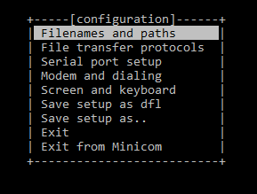
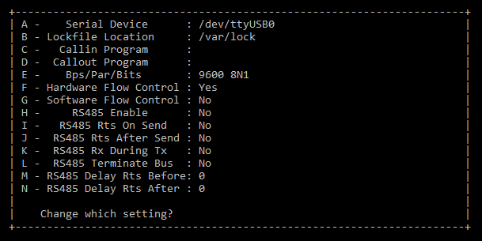

# Minicom - Memento
<i>Memento to initialize serial connections with Minicom on Linux systems !</i>
__________

### Prerequisite : 

If by default Minicom isn't installed, you can do it via these commands :

```
apt install minicom -y
```
<i>For Debian distributions or</i>
```
dnf install minicom -y
```
<i>For RedHat ones</i>

Of course, to use Minicom you will need an equipment with a serial port like a switch or a router for example. This connection is possible only if you have a serial wire (depends of the equipment and its brand).

## I - Presentation

So, what is Minicom ? It's a useful package to handle a serial connection on Linux systems between your device and another equipment. It's (most of the time) a direct connection, so the wire is plugged without any intermediate. Minicom is free and open source, and runs under most linux distributions. Finally, it handles the well-known standards like RS-232, RS-485 or RS-422. 

>As I said before, most of the time serial connections need a wire to join directly the PC and the device. But alternatives exist like the Moxa 6150 for example. This kind of equipment permits to join the device via an Ethernet connection. So, you don't have do be physically in front of the device especially for reloading it and in this case, Minicom is useless. It only needs a simple terminal to initialize a telnet/ssh connection through the equipment !

## II - Minicom configuration

Before initializing a serial connection with Minicom, we need to configure it to create a default configuration that you can use in almost every cases. 
First, enter this command to identify the port used for the serial connection :
```
dmesg
```
Of course, the device has to be plugged into the PC before doing this.
Then, you have to do this command with <u>root privileges</u> :
```
minicom -s
```
You should have this menu :
<div style="text-align:center"></div>
<br>
Go to <b>Serial port setup</b> and press <b>A</b>.
Enter the port identified with the <u>dmesg command</u> <i>(For example : /dev/ttyUSB0)</i> and press <b>Enter</b>.
<br>Now, we have to modify the speed in bps of the connection. Press <b>E</b> and select <u>9600 bps</u> (press C), the most common speed for serial connections, and press <b>Enter</b>.<br>
I advise you to take a look on your operating manual of the equipment to be sure of the settings of the serial connection. They can change because of the brand or the model.<br>
Then, you should have something like that :
<br>
<br>
<div style="text-align:center"></div>
<br>
You can now press <b>Enter</b> and select <b>Save setup as dfl</b> (dfl = default) for the next connections. This option requires root privileges and that's why we had to configure minicom with the root user.


## III - Initialize a serial connection

To start the serial connection, just enter the command <b>minicom</b> in a terminal and you will be able to interact with your equipment via the serial wire. Be sure that you plugged the wire in the same port with the <b>dmesg</b> command. If not, configure minicom again or change phisically the port on your device.

__________
<i>Updated : 07/10/2022, Author : Xen0rInspire</i>
